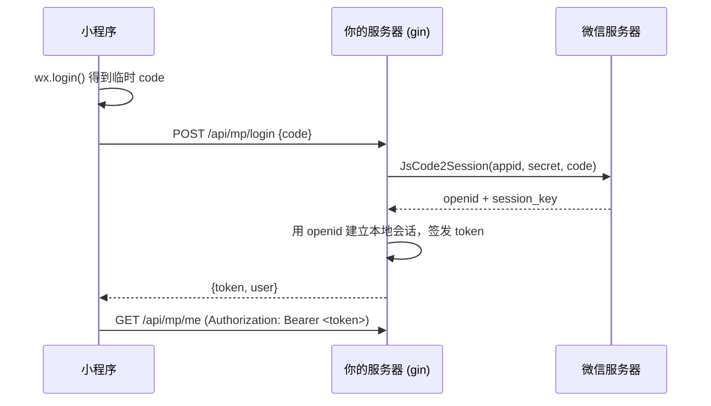
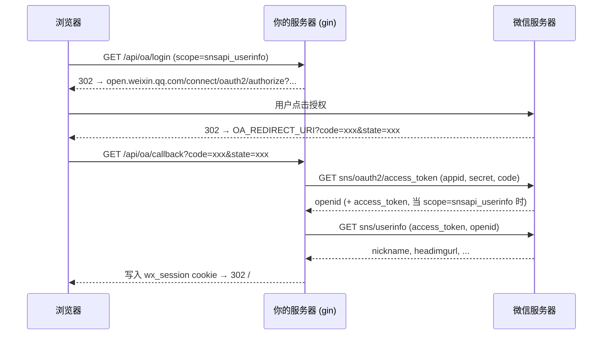

# gin-login: 小程序 & 公众号登录流程示例

A runnable [Gin](https://github.com/gin-gonic/gin) server that demonstrates the
two most common WeChat login flows using
[`github.com/go-sphere/weixin-api`](../../README.md):

| Flow | 说明 | Route | Library call |
| --- | --- | --- | --- |
| 小程序登录 | `wx.login()` code → `openid`/`session_key` | `POST /api/mp/login` | `miniprogram.MiniProgram.JsCode2Session` |
| 公众号/服务号网页授权 | 网页 OAuth2（snsapi_base / snsapi_userinfo） | `GET /api/oa/login` → `GET /api/oa/callback` | `official.OfficialAccount` + `core.Client.GetJSON` |

This module is a **separate Go module inside the repository**, which is why it
uses a `replace` directive instead of a plain import:

```go
// examples/gin-login/go.mod
require github.com/go-sphere/weixin-api v0.0.0

// Pull the library from the sibling checkout instead of a published version.
// When copying this example into your own project, point this at your copy:
//   replace github.com/go-sphere/weixin-api => /absolute/path/to/weixin-api
replace github.com/go-sphere/weixin-api => ../..
```

> Note: Go ignores `replace` when the target module is already the main module
> (`go run .` at the repository root), so this example is always built from its
> own directory (`examples/gin-login`).

## Run

```sh
cd examples/gin-login

export MP_APP_ID="wx<your-miniprogram-appid>"
export MP_APP_SECRET="<your-miniprogram-secret>"
export OA_APP_ID="wx<your-official-account-appid>"
export OA_APP_SECRET="<your-official-account-secret>"
export OA_REDIRECT_URI="https://your.domain.com/api/oa/callback"  # 公众号后台「网页授权域名」必须配置为回调的域名
export PORT=8080

go run .
```

Both WeChat clients are created with a `nil` cache, so the library uses its
built-in in-process memory cache for `access_token`. In a multi-instance
deployment share one [`core.Cache`](../../core/cache.go) (e.g. Redis-backed)
between the clients.

## 小程序登录流程 (Mini Program)



```sh
# 1. 小程序端 wx.login() 成功后，把 code 发给服务器
curl -X POST localhost:8080/api/mp/login \
  -H 'Content-Type: application/json' \
  -d '{"code": "<wx.login() 返回的 code>"}'

# 2. 拿到 token 后，后续请求带上它
curl localhost:8080/api/mp/me \
  -H "Authorization: Bearer <上一步返回的 token>"
```

Implementation: [mp_login.go](mp_login.go). The `session_key` returned by
`JsCode2Session` is not returned to the client — it stays server-side and is the
key used to decrypt user data (phone number, etc.).

## 公众号/服务号网页授权流程 (Official Account web OAuth)



In a browser:

1. Visit `http://localhost:8080/api/oa/login?scope=snsapi_userinfo`. The server
   redirects to WeChat, the user authorizes, and WeChat redirects back to
   `/api/oa/callback?code=...&state=...`.
2. The server exchanges the code for the openid, fetches the profile (because
   `snsapi_userinfo` was granted), and sets the `wx_session` cookie.
3. `GET /api/oa/me` returns the logged-in account from the cookie.

Non-browser callers can fetch the authorize URL as JSON:

```sh
curl 'localhost:8080/api/oa/login?scope=snsapi_base&json=1'
# => {"authorize_url":"https://open.weixin.qq.com/connect/oauth2/authorize?...","scope":"snsapi_base"}
```

then hit the callback with `&json=1` (the callback responds with the session
token and account JSON instead of redirecting).

Implementation: [oa_login.go](oa_login.go).

> 说明：本库的 `official` 包目前还没有封装网页授权的 sns 接口，但
> `OfficialAccount` 内嵌了 `*core.Client`，所以这里直接用提升上来的
> [`core.Client.GetJSON`](../../core/client.go) 调用 `sns/oauth2/access_token`
> 和 `sns/userinfo`，响应校验（HTTP 状态 + `errcode` 非零）与库内其它接口完全一致。
> 另外 `miniprogram` 包里的 `SnsOauth2` / `GetOAuth2UserInfo` 也封装了同样的
> 接口，可以按需使用。

## Linking both identities (unionid)

Both flows store the user under `Store` by `openid`. If the Mini Program and the
official account belong to the same WeChat Open Platform account (绑定开放平台),
the `unionid` returned by both flows lets the demo `Store.Upsert` recognize the
two openids as one user (see [store.go](store.go)).

## Session & security notes (demo-grade, not production-grade)

- Tokens are random values signed with a per-process HMAC secret; sessions live
  in a process-local map. Use a real database/session store in production.
- The demo skips: encrypted payload decryption, JS-SDK config
  (`GetJSSDKConfig`), phone-number retrieval, and real token expiry handling.

## Files

- [main.go](main.go) — config from environment variables, Gin routes.
- [mp_login.go](mp_login.go) — Mini Program login + `/me`.
- [oa_login.go](oa_login.go) — Official Account web authorization flow.
- [store.go](store.go) — in-memory account store + bearer/cookie auth middleware.
- [main_test.go](main_test.go) — local tests (no network access).

```sh
go test ./...   # run the tests
```
